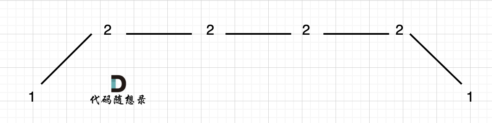

## 贪心的使用场景

**贪心的本质是选择每一阶段的局部最优，从而达到全局最优**。

贪心算法一般分为如下四步：

- 将问题分解为若干个子问题
- 找出适合的贪心策略
- 求解每一个子问题的最优解
- 将局部最优解堆叠成全局最优解

## leetcode 455 分发饼干

### 题目描述

[力扣题目链接(opens new window)](https://leetcode.cn/problems/assign-cookies/)

假设你是一位很棒的家长，想要给你的孩子们一些小饼干。但是，每个孩子最多只能给一块饼干。

对每个孩子 i，都有一个胃口值  g[i]，这是能让孩子们满足胃口的饼干的最小尺寸；并且每块饼干 j，都有一个尺寸 s[j] 。如果 s[j] >= g[i]，我们可以将这个饼干 j 分配给孩子 i ，这个孩子会得到满足。你的目标是尽可能满足越多数量的孩子，并输出这个最大数值。

示例  1:

- 输入: g = [1,2,3], s = [1,1]
- 输出: 1 解释:你有三个孩子和两块小饼干，3 个孩子的胃口值分别是：1,2,3。虽然你有两块小饼干，由于他们的尺寸都是 1，你只能让胃口值是 1 的孩子满足。所以你应该输出 1。

示例  2:

- 输入: g = [1,2], s = [1,2,3]
- 输出: 2
- 解释:你有两个孩子和三块小饼干，2 个孩子的胃口值分别是 1,2。你拥有的饼干数量和尺寸都足以让所有孩子满足。所以你应该输出 2.

提示：

- 1 <= g.length <= 3 * 10^4
- 0 <= s.length <= 3 * 10^4
- 1 <= g[i], s[j] <= 2^31 - 1

### 思路解析

**局部最优就是大饼干喂给胃口大的，充分利用饼干尺寸喂饱一个，全局最优就是喂饱尽可能多的小孩**。

因此可以将胃口数组和饼干数组进行预先排序。然后从后向前遍历小孩数组，用大饼干优先满足胃口大的，并统计满足小孩数量。

### 参考代码

```java
class Solution {
    public int findContentChildren(int[] g, int[] s) {
        Arrays.sort(g);
        Arrays.sort(s);
        int ans=0;
        int index=s.length-1;
        for(int i=g.length-1;i>=0;i--)
        {
            if(s[index]>g[i])
            {
                ans++;
                index--;
            }
        }
        return ans;
    }
}
```

## leetcode 376 摆动序列

### 题目描述

[力扣题目链接(opens new window)](https://leetcode.cn/problems/wiggle-subsequence/)

如果连续数字之间的差严格地在正数和负数之间交替，则数字序列称为摆动序列。第一个差（如果存在的话）可能是正数或负数。少于两个元素的序列也是摆动序列。

例如， [1,7,4,9,2,5] 是一个摆动序列，因为差值 (6,-3,5,-7,3) 是正负交替出现的。相反, [1,4,7,2,5] 和  [1,7,4,5,5] 不是摆动序列，第一个序列是因为它的前两个差值都是正数，第二个序列是因为它的最后一个差值为零。

给定一个整数序列，返回作为摆动序列的最长子序列的长度。 通过从原始序列中删除一些（也可以不删除）元素来获得子序列，剩下的元素保持其原始顺序。

示例 1:

- 输入: [1,7,4,9,2,5]
- 输出: 6
- 解释: 整个序列均为摆动序列。

示例 2:

- 输入: [1,17,5,10,13,15,10,5,16,8]
- 输出: 7
- 解释: 这个序列包含几个长度为 7 摆动序列，其中一个可为[1,17,10,13,10,16,8]。

示例 3:

- 输入: [1,2,3,4,5,6,7,8,9]
- 输出: 2

### 思路解析

本题要求通过从原始序列中删除一些（也可以不删除）元素来获得子序列，剩下的元素保持其原始顺序。

**局部最优：删除单调坡度上的节点（不包括单调坡度两端的节点），那么这个坡度就可以有两个局部峰值**。

**整体最优：整个序列有最多的局部峰值，从而达到最长摆动序列**。

而摆动序列的长度就是峰值的个数

可以通过记录 **`prediff（nums[i] - nums[i-1]）`** 和 **`curdiff（nums[i+1] - nums[i]）`** ，如果`prediff < 0 && curdiff > 0` 或者 `prediff > 0 && curdiff < 0` 此时就有波动就需要统计。

其中 **`prediff`** 用于记录上一个坡度的方向，**`curdiff`** 用于记录当前坡度的方向

但是可能会出现平坡的情况

- 上下坡中出现平坡

  - 在计数的时候统一删除左边的重复项（左边的3个2）
    - **`prediff = 0 && curdiff < 0`** 需要被记录为一个峰值
    - 同理，**`prediff = 0 && curdiff > 0`** 需要被记录为一个峰值

- 数组两端

  

  - 可以假设，数组最前面还有一个数字，那这个数字为本身。这样默认数组最右侧具有一个峰值

- 单调坡中出现平坡

  - 需要在 这个坡度 摆动变化的时候，更新 prediff 就行

### 参考代码

```java
class Solution {
    public int wiggleMaxLength(int[] nums) {
        if(nums.length<=1)return nums.length;
        int prediff=0;
        int curdiff=0;
        int res=1;
        for(int i=0;i<nums.length-1;i++)
        {
            curdiff=nums[i+1]-nums[i];
            if((prediff>=0&&curdiff<0)||(prediff<=0&&curdiff>0))
            {
                res++;
                prediff=curdiff;
            }
        }
        return res;
    }
}
```

## leetcode 53 最大子序和

### 题目描述

[力扣题目链接(opens new window)](https://leetcode.cn/problems/maximum-subarray/)

给定一个整数数组 nums ，找到一个具有最大和的连续子数组（子数组最少包含一个元素），返回其最大和。

示例:

- 输入: [-2,1,-3,4,-1,2,1,-5,4]
- 输出: 6
- 解释: 连续子数组  [4,-1,2,1] 的和最大，为  6。

### 思路解析

如果 -2 1 在一起，计算起点的时候，一定是从 1 开始计算，因为负数只会拉低总和

局部最优：当前“连续和”为负数的时候立刻放弃，从下一个元素重新计算“连续和”，因为负数加上下一个元素 “连续和”只会越来越小。

全局最优：选取最大“连续和”

### 参考代码

```java
class Solution {
    public int maxSubArray(int[] nums) {
        int res=Integer.MIN_VALUE;
        int count=0;
        for(int i=0;i<nums.length;i++)
        {
            count+=nums[i];
            if(count>res)
                res=count;
            if(count<=0)
            {
                count=0;
            }
        }
        return res;
    }
}
```

## leetcode 122 买卖股票的最佳时机II

### 题目描述

[力扣题目链接(opens new window)](https://leetcode.cn/problems/best-time-to-buy-and-sell-stock-ii/)

给定一个数组，它的第  i 个元素是一支给定股票第 i 天的价格。

设计一个算法来计算你所能获取的最大利润。你可以尽可能地完成更多的交易（多次买卖一支股票）。

注意：你不能同时参与多笔交易（你必须在再次购买前出售掉之前的股票）。

示例 1:

- 输入: [7,1,5,3,6,4]
- 输出: 7
- 解释: 在第 2 天（股票价格 = 1）的时候买入，在第 3 天（股票价格 = 5）的时候卖出, 这笔交易所能获得利润 = 5-1 = 4。随后，在第 4 天（股票价格 = 3）的时候买入，在第 5 天（股票价格 = 6）的时候卖出, 这笔交易所能获得利润 = 6-3 = 3 。

示例 2:

- 输入: [1,2,3,4,5]
- 输出: 4
- 解释: 在第 1 天（股票价格 = 1）的时候买入，在第 5 天 （股票价格 = 5）的时候卖出, 这笔交易所能获得利润 = 5-1 = 4 。注意你不能在第 1 天和第 2 天接连购买股票，之后再将它们卖出。因为这样属于同时参与了多笔交易，你必须在再次购买前出售掉之前的股票。

示例  3:

- 输入: [7,6,4,3,1]
- 输出: 0
- 解释: 在这种情况下, 没有交易完成, 所以最大利润为 0。

提示：

- 1 <= prices.length <= 3 * 10 ^ 4
- 0 <= prices[i] <= 10 ^ 4

### 思路解析

**利润是可以分解的**

假如第 0 天买入，第 3 天卖出，那么利润为：prices[3] - prices[0]。

相当于(prices[3] - prices[2]) + (prices[2] - prices[1]) + (prices[1] - prices[0])。

**此时就是把利润分解为每天为单位的维度，而不是从 0 天到第 3 天整体去考虑**

**收集正利润的区间，就是股票买卖的区间，而只需要关注最终利润，不需要记录区间**。

**局部最优：收集每天的正利润，全局最优：求得最大利润**。

### 参考代码

```java
class Solution {
    public int maxProfit(int[] prices) {
        int res=0;
        for(int i=1;i<prices.length;i++)
        {
            if(prices[i]-prices[i-1]>0)
                res+=prices[i]-prices[i-1];
        }
        return res;
    }
}
```

## leetcode 55 跳跃游戏

### 题目描述

[力扣题目链接(opens new window)](https://leetcode.cn/problems/jump-game/)

给定一个非负整数数组，你最初位于数组的第一个位置。

数组中的每个元素代表你在该位置可以跳跃的最大长度。

判断你是否能够到达最后一个位置。

示例  1:

- 输入: [2,3,1,1,4]
- 输出: true
- 解释: 我们可以先跳 1 步，从位置 0 到达 位置 1, 然后再从位置 1 跳 3 步到达最后一个位置。

示例  2:

- 输入: [3,2,1,0,4]
- 输出: false
- 解释: 无论怎样，你总会到达索引为 3 的位置。但该位置的最大跳跃长度是 0 ， 所以你永远不可能到达最后一个位置。

### 思路解析

**问题就转化为跳跃覆盖范围究竟可不可以覆盖到终点！**

每次移动取最大跳跃步数（得到最大的覆盖范围），每移动一个单位，就更新最大覆盖范围。

**贪心算法局部最优解：每次取最大跳跃步数（取最大覆盖范围），整体最优解：最后得到整体最大覆盖范围，看是否能到终点**。

每次在覆盖范围内移动指针，更新最大覆盖范围

### 参考代码

```java
class Solution {
    public boolean canJump(int[] nums) {
        int cover=0;
        for(int i=0;i<=cover;i++)
        {
            cover=Math.max(nums[i]+i,cover);
            if(cover>=nums.length-1)
                return true;
        }
        return false;
    }
}
```

## leetcode 45 跳跃游戏II

### 题目描述

[力扣题目链接(opens new window)](https://leetcode.cn/problems/jump-game-ii/)

给定一个非负整数数组，你最初位于数组的第一个位置。

数组中的每个元素代表你在该位置可以跳跃的最大长度。

你的目标是使用最少的跳跃次数到达数组的最后一个位置。

示例:

- 输入: [2,3,1,1,4]
- 输出: 2
- 解释: 跳到最后一个位置的最小跳跃数是 2。从下标为 0 跳到下标为 1 的位置，跳  1 步，然后跳  3 步到达数组的最后一个位置。

说明: 假设你总是可以到达数组的最后一个位置。

### 思路解析

**要从覆盖范围出发，不管怎么跳，覆盖范围内一定是可以跳到的，以最小的步数增加覆盖范围，覆盖范围一旦覆盖了终点，得到的就是最少步数！**

**统计两个覆盖范围，当前这一步的最大覆盖和下一步最大覆盖**。

如果移动下标达到了当前这一步的最大覆盖最远距离了，还没有到终点的话，那么就必须再走一步来增加覆盖范围，直到覆盖范围覆盖了终点。

### 参考代码

```java
class Solution {
    public int jump(int[] nums) {
        int currDistance=0;
        int maxDistance=0;
        int count=0;
        for(int i=0;i<nums.length-1;i++)
        {
            maxDistance=Math.max(maxDistance,i+nums[i]);
            if(i==currDistance)
            {
                currDistance=maxDistance;
                count++;
            }
        }
        return count;
    }
}
```

## leetcode 1005 K次取反后最大化的数组和

### 题目描述

[力扣题目链接(opens new window)](https://leetcode.cn/problems/maximize-sum-of-array-after-k-negations/)

给定一个整数数组 A，我们只能用以下方法修改该数组：我们选择某个索引 i 并将 A[i] 替换为 -A[i]，然后总共重复这个过程 K 次。（我们可以多次选择同一个索引 i。）

以这种方式修改数组后，返回数组可能的最大和。

示例 1：

- 输入：A = [4,2,3], K = 1
- 输出：5
- 解释：选择索引 (1) ，然后 A 变为 [4,-2,3]。

示例 2：

- 输入：A = [3,-1,0,2], K = 3
- 输出：6
- 解释：选择索引 (1, 2, 2) ，然后 A 变为 [3,1,0,2]。

示例 3：

- 输入：A = [2,-3,-1,5,-4], K = 2
- 输出：13
- 解释：选择索引 (1, 4) ，然后 A 变为 [2,3,-1,5,4]。

提示：

- 1 <= A.length <= 10000
- 1 <= K <= 10000
- -100 <= A[i] <= 100

### 思路解析

将数组进行排序，其中负数部分直接使用转换变为正数。如果K次还没有用完则将数组再次排序，将剩下的次数全部用在绝对值最小的数上。

### 参考代码

```java
class Solution {
    public int largestSumAfterKNegations(int[] nums, int k) {
        Arrays.sort(nums);
        int res=0;
        for(int i=0;i<nums.length;i++)
        {
            if(nums[i]<0&&k>0)
            {
                nums[i]=-nums[i];
                k--;
            }
        }
        if(k%2==1)
        {
            Arrays.sort(nums);
            nums[0]=-nums[0];
        }
        for(int i=0;i<nums.length;i++)
        {
            res+=nums[i];
        }
        return res;
    }
}
```

## leetcode 134 加油站

### 题目描述

[力扣题目链接(opens new window)](https://leetcode.cn/problems/gas-station/)

在一条环路上有 N 个加油站，其中第 i 个加油站有汽油 gas[i] 升。

你有一辆油箱容量无限的的汽车，从第 i 个加油站开往第 i+1 个加油站需要消耗汽油 cost[i] 升。你从其中的一个加油站出发，开始时油箱为空。

如果你可以绕环路行驶一周，则返回出发时加油站的编号，否则返回 -1。

说明:

- 如果题目有解，该答案即为唯一答案。
- 输入数组均为非空数组，且长度相同。
- 输入数组中的元素均为非负数。

示例 1: 输入:

- gas = [1,2,3,4,5]
- cost = [3,4,5,1,2]

输出: 3 解释:

- 从 3 号加油站(索引为 3 处)出发，可获得 4 升汽油。此时油箱有 = 0 + 4 = 4 升汽油
- 开往 4 号加油站，此时油箱有 4 - 1 + 5 = 8 升汽油
- 开往 0 号加油站，此时油箱有 8 - 2 + 1 = 7 升汽油
- 开往 1 号加油站，此时油箱有 7 - 3 + 2 = 6 升汽油
- 开往 2 号加油站，此时油箱有 6 - 4 + 3 = 5 升汽油
- 开往 3 号加油站，你需要消耗 5 升汽油，正好足够你返回到 3 号加油站。
- 因此，3 可为起始索引。

示例 2: 输入:

- gas = [2,3,4]
- cost = [3,4,3]
- 输出: -1
- 解释: 你不能从 0 号或 1 号加油站出发，因为没有足够的汽油可以让你行驶到下一个加油站。我们从 2 号加油站出发，可以获得 4 升汽油。 此时油箱有 = 0 + 4 = 4 升汽油。开往 0 号加油站，此时油箱有 4 - 3 + 2 = 3 升汽油。开往 1 号加油站，此时油箱有 3 - 3 + 3 = 3 升汽油。你无法返回 2 号加油站，因为返程需要消耗 4 升汽油，但是你的油箱只有 3 升汽油。因此，无论怎样，你都不可能绕环路行驶一周。

### 思路解析

#### 思路一

- 如果总油量减去总消耗大于等于零那么一定可以跑完一圈，说明 各个站点的加油站 剩油量rest[i]相加一定是大于等于零的。
- i从0开始累加rest[i]，和记为curSum，一旦curSum小于零，说明[0, i]区间都不能作为起始位置，因为这个区间选择任何一个位置作为起点，到i这里都会断油，那么起始位置从i+1算起，再从0计算curSum。
- 若totalSum<0则说明断油了，返回-1

#### 参考代码(思路一)

```java
class Solution {
    public int canCompleteCircuit(int[] gas, int[] cost) {
        int n=cost.length;
        // 从start出发的净油量
        int curSum=0;
        // 从0开始的净油量
        int totalSum=0;
        int start=0;
        for(int i=0;i<n;i++){
            curSum+=gas[i]-cost[i];
            totalSum+=gas[i]-cost[i];
            if(curSum<0){
                start=i+1;
                curSum=0;
            }
        }
        if(totalSum<0){
            return -1;
        }
        return start;
    }
}
```

#### 思路二

从加油站*x*出发，每经过一个加油站就加一次油（包括起始加油站），最后一个可以到达的加油站是*y*（不妨设*x*<*y*）若x到y的净油量等于零（最后一个到达的加油站为y）则从x到y之间的任意一个加油站出发都无法到达y的下一个加油站

首先检查第0个加油站，并试图判断能否环绕一周；如果不能，就从第一个无法到达的加油站开始继续检查。

#### 参考代码（思路二）

```java
class Solution {
    public int canCompleteCircuit(int[] gas, int[] cost) {
        int n=cost.length;
        int x=0;
        while(x<n){
            int sumGas=0;
            int sumCost=0;
            int cnt=0; //覆盖的加油站数
            while(cnt<n){
                int y=(x+cnt)%n; // 计算加油站编号y
                // 计算x~y的油量和花费
                sumGas+=gas[y];
                sumCost+=cost[y];
                // 无法到达则直接停止循环
                if(sumGas<sumCost){
                    break;
                }
                cnt++;
            }
            // 成功环绕一圈则直接返回x
            if(cnt==n){
                return x;
            }else{
                x=x+cnt+1; // 更新x为x+y的下一个位置
            }
        }
        return -1;
    }
}
```

## leetcode 860 柠檬水找零

### 题目描述

[力扣题目链接(opens new window)](https://leetcode.cn/problems/lemonade-change/)

在柠檬水摊上，每一杯柠檬水的售价为 5 美元。

顾客排队购买你的产品，（按账单 bills 支付的顺序）一次购买一杯。

每位顾客只买一杯柠檬水，然后向你付 5 美元、10 美元或 20 美元。你必须给每个顾客正确找零，也就是说净交易是每位顾客向你支付 5 美元。

注意，一开始你手头没有任何零钱。

如果你能给每位顾客正确找零，返回 true ，否则返回 false 。

示例 1：

- 输入：[5,5,5,10,20]
- 输出：true
- 解释：
  - 前 3 位顾客那里，我们按顺序收取 3 张 5 美元的钞票。
  - 第 4 位顾客那里，我们收取一张 10 美元的钞票，并返还 5 美元。
  - 第 5 位顾客那里，我们找还一张 10 美元的钞票和一张 5 美元的钞票。
  - 由于所有客户都得到了正确的找零，所以我们输出 true。

示例 2：

- 输入：[5,5,10]
- 输出：true

示例 3：

- 输入：[10,10]
- 输出：false

示例 4：

- 输入：[5,5,10,10,20]
- 输出：false
- 解释：
  - 前 2 位顾客那里，我们按顺序收取 2 张 5 美元的钞票。
  - 对于接下来的 2 位顾客，我们收取一张 10 美元的钞票，然后返还 5 美元。
  - 对于最后一位顾客，我们无法退回 15 美元，因为我们现在只有两张 10 美元的钞票。
  - 由于不是每位顾客都得到了正确的找零，所以答案是 false。

提示：

- 0 <= bills.length <= 10000
- bills[i] 不是 5 就是 10 或是 20

### 思路解析

- 情况一：账单是5，直接收下。
- 情况二：账单是10，消耗一个5，增加一个10
- 情况三：账单是20，优先消耗一个10和一个5，如果不够，再消耗三个5

### 参考代码

```java
class Solution {
    public boolean lemonadeChange(int[] bills) {
        int fiveCount=0;
        int tenCount=0;
        int twentyCount=0;
        for(int i=0;i<bills.length;i++)
        {
            if(bills[i]==5)
                fiveCount++;
            else if(bills[i]==10)
            {
                tenCount++;
                fiveCount--;
                if(fiveCount<0)
                {
                    return false;
                }
            }
            else if(bills[i]==20)
            {
                twentyCount++; // 收下一张二十
                // 优先找一张十块和一张五块
                if(fiveCount>=1&&tenCount>=1)
                {
                    fiveCount--;
                    tenCount--;
                }
                // 其次找三张五块
                else if(fiveCount>=3)
                {
                    fiveCount-=3;
                }
                else{
                    return false;
                }
            }
        }
        return true;
    }
}
```


## 多维度贪心

### leetcode 135 分发糖果

#### 题目描述

[力扣题目链接(opens new window)](https://leetcode.cn/problems/candy/)

老师想给孩子们分发糖果，有 N 个孩子站成了一条直线，老师会根据每个孩子的表现，预先给他们评分。

你需要按照以下要求，帮助老师给这些孩子分发糖果：

- 每个孩子至少分配到 1 个糖果。
- 相邻的孩子中，评分高的孩子必须获得更多的糖果。

那么这样下来，老师至少需要准备多少颗糖果呢？

示例 1:

- 输入: [1,0,2]
- 输出: 5
- 解释: 你可以分别给这三个孩子分发 2、1、2 颗糖果。

示例 2:

- 输入: [1,2,2]
- 输出: 4
- 解释: 你可以分别给这三个孩子分发 1、2、1 颗糖果。第三个孩子只得到 1 颗糖果，这已满足上述两个条件。

#### 思路解析

本题一定是要确定一边之后，再确定另一边，例如比较每一个孩子的左边，然后再比较右边，**如果两边一起考虑一定会顾此失彼**。

- 确定左边评分小于右边的情况（也就是从前向后遍历）
  - 此时局部最优：只要右边评分比左边大，右边的孩子就多一个糖果
  - 全局最优：相邻的孩子中，评分高的右孩子获得比左边孩子更多的糖果
- 确定左边评分大于右边（从后向前遍历）
  - candyVec[i]（第i个小孩的糖果数量）就有两个选择了
    - 一个是candyVec[i + 1] + 1（从右边这个加1得到的糖果数量）
    - 一个是candyVec[i]（之前比较右孩子大于左孩子得到的糖果数量）。
  - 局部最优：取candyVec[i + 1] + 1 和 candyVec[i] 最大的糖果数量，保证第i个小孩的糖果数量既大于左边的也大于右边的。
  - 全局最优：相邻的孩子中，评分高的孩子获得更多的糖果。

#### 参考代码

```java
class Solution {
    public int candy(int[] ratings) {
        int n=ratings.length;
        int[]candy=new int[n];
        Arrays.fill(candy,1);
        // 从左往右遍历，处理左孩子小于右孩子
        for(int i=1;i<n;i++){
            if(ratings[i-1]<ratings[i]){
                candy[i]=candy[i-1]+1;
            }
        }
        // 从右往左遍历，处理左孩子大于右孩子
        for(int i=n-2;i>=0;i--){
            if(ratings[i]>ratings[i+1]){
                candy[i]=Math.max(candy[i],candy[i+1]+1);
            }
        }
        int res=0;
        for(Integer i:candy){
            res+=i;
        }
        return res;

    }
}
```

### leetcode 406 根据身高重建队列

#### 题目描述

[力扣题目链接(opens new window)](https://leetcode.cn/problems/queue-reconstruction-by-height/)

假设有打乱顺序的一群人站成一个队列，数组 people 表示队列中一些人的属性（不一定按顺序）。每个 people[i] = [hi, ki] 表示第 i 个人的身高为 hi ，前面 正好 有 ki 个身高大于或等于 hi 的人。

请你重新构造并返回输入数组 people 所表示的队列。返回的队列应该格式化为数组 queue ，其中 queue[j] = [hj, kj] 是队列中第 j 个人的属性（queue[0] 是排在队列前面的人）。

示例 1：

- 输入：people = [[7,0],[4,4],[7,1],[5,0],[6,1],[5,2]]
- 输出：[[5,0],[7,0],[5,2],[6,1],[4,4],[7,1]]
- 解释：
  - 编号为 0 的人身高为 5 ，没有身高更高或者相同的人排在他前面。
  - 编号为 1 的人身高为 7 ，没有身高更高或者相同的人排在他前面。
  - 编号为 2 的人身高为 5 ，有 2 个身高更高或者相同的人排在他前面，即编号为 0 和 1 的人。
  - 编号为 3 的人身高为 6 ，有 1 个身高更高或者相同的人排在他前面，即编号为 1 的人。
  - 编号为 4 的人身高为 4 ，有 4 个身高更高或者相同的人排在他前面，即编号为 0、1、2、3 的人。
  - 编号为 5 的人身高为 7 ，有 1 个身高更高或者相同的人排在他前面，即编号为 1 的人。
  - 因此 [[5,0],[7,0],[5,2],[6,1],[4,4],[7,1]] 是重新构造后的队列。

示例 2：

- 输入：people = [[6,0],[5,0],[4,0],[3,2],[2,2],[1,4]]
- 输出：[[4,0],[5,0],[2,2],[3,2],[1,4],[6,0]]

提示：

- 1 <= people.length <= 2000
- 0 <= hi <= 10^6
- 0 <= ki < people.length

题目数据确保队列可以被重建

#### 思路解析

本题有两个维度，一个维度是排序，另一个维度是身高。因此需要先确定一个维度再来确定另一个维度。

如果按照k来从小到大排序，排完之后，会发现k的排列并不符合条件，身高也不符合条件，两个维度哪一个都没确定下来。

那么按照身高h来排序呢，身高一定是从大到小排（身高相同的话则k小的站前面），让高个子在前面。然后只需要按照k为下标重新插入队列就可以了

- **局部最优：优先按身高高的people的k来插入。插入操作过后的people满足队列属性**
- **全局最优：最后都做完插入操作，整个队列满足题目队列属性**

#### 参考代码

```java
class Solution {
    public int[][] reconstructQueue(int[][] people) {
        Arrays.sort(people, new Comparator<int[]>() {
            @Override
            public int compare(int[] o1, int[] o2) {
                if(o1[0]==o2[0])
                    return o1[1]-o2[1];
                return o2[0]-o1[0];
            }
        });
        LinkedList<int[]>que=new LinkedList<>();
        for(int[]p:people){
            que.add(p[1],p);
        }
        return que.toArray(new int[people.length][]);
    }
}
```

## 重叠区间问题

### 代码模板（求解非重叠区间的个数）

- 将区间按照左端点进行排序
- 设置count=1（至少有一个非重叠区间）
- 从i=1开始遍历
  - 若第i个区间的左端点大于第i-1个区间的右端点则两个区间不重叠
  - 否则两个区间重叠，更新两个区间的右区间为重叠区间的右端点的最小值

### 代码模板（求解非重叠区间）

- 将区间按照左端点
- 先将第一个区间加入结果集合
- 从i=1开始遍历
  - 若第i个区间的左端点和结果集的最后一个区间的右端点则两个区间不重叠直接加入结果集合
  - 否则两个区间重叠，合并两个区间，更新结果集合的最后一个区间（左端点为结果集合的最后一个区间的左端点，右端点为结果集合的最后一个区间的右端点和第i个区间的右端点的较小值）

### leetcode 452 用最少数量的箭引爆气球

#### 题目描述

[力扣题目链接(opens new window)](https://leetcode.cn/problems/minimum-number-of-arrows-to-burst-balloons/)

在二维空间中有许多球形的气球。对于每个气球，提供的输入是水平方向上，气球直径的开始和结束坐标。由于它是水平的，所以纵坐标并不重要，因此只要知道开始和结束的横坐标就足够了。开始坐标总是小于结束坐标。

一支弓箭可以沿着 x 轴从不同点完全垂直地射出。在坐标 x 处射出一支箭，若有一个气球的直径的开始和结束坐标为 xstart，xend， 且满足  xstart ≤ x ≤ xend，则该气球会被引爆。可以射出的弓箭的数量没有限制。 弓箭一旦被射出之后，可以无限地前进。我们想找到使得所有气球全部被引爆，所需的弓箭的最小数量。

给你一个数组 points ，其中 points [i] = [xstart,xend] ，返回引爆所有气球所必须射出的最小弓箭数。

示例 1：

- 输入：points = [[10,16],[2,8],[1,6],[7,12]]
- 输出：2
- 解释：对于该样例，x = 6 可以射爆 [2,8],[1,6] 两个气球，以及 x = 11 射爆另外两个气球

示例 2：

- 输入：points = [[1,2],[3,4],[5,6],[7,8]]
- 输出：4

示例 3：

- 输入：points = [[1,2],[2,3],[3,4],[4,5]]
- 输出：2

示例 4：

- 输入：points = [[1,2]]
- 输出：1

示例 5：

- 输入：points = [[2,3],[2,3]]
- 输出：1

提示：

- 0 <= points.length <= 10^4
- points[i].length == 2
- -2^31 <= xstart < xend <= 2^31 - 1

#### 思路解析

本题非重叠区间的个数就是箭的个数，套代码模板即可

#### 参考代码

```java
class Solution {
    public int findMinArrowShots(int[][] points) {
        // 对区间的左端点排序
        Arrays.sort(points, new Comparator<int[]>() {
            @Override
            public int compare(int[] o1, int[] o2) {
                return Integer.compare(o1[0],o2[0]);
            }
        });
        int count=1;
        for(int i=1;i<points.length;i++){
            if(points[i][0]>points[i-1][1]){ // 不重叠的情况
                count++;
            }else{
                points[i][1]=Math.min(points[i-1][1],points[i][1]); // 重叠的情况更新右节点
            }
        }
        return count;
    }
}
```

### leetcode 435 无重叠区间

#### 题目描述

[力扣题目链接(opens new window)](https://leetcode.cn/problems/non-overlapping-intervals/)

给定一个区间的集合，找到需要移除区间的最小数量，使剩余区间互不重叠。

注意: 可以认为区间的终点总是大于它的起点。 区间 [1,2] 和 [2,3] 的边界相互“接触”，但没有相互重叠。

示例 1:

- 输入: [ [1,2], [2,3], [3,4], [1,3] ]
- 输出: 1
- 解释: 移除 [1,3] 后，剩下的区间没有重叠。

示例 2:

- 输入: [ [1,2], [1,2], [1,2] ]
- 输出: 2
- 解释: 你需要移除两个 [1,2] 来使剩下的区间没有重叠。

示例 3:

- 输入: [ [1,2], [2,3] ]
- 输出: 0
- 解释: 你不需要移除任何区间，因为它们已经是无重叠的了。

#### 思路解析

移除非重叠的区间即可，因此求出非重叠区间个数，然后数组长度-非重叠区间即可

#### 参考代码

```java
// 求解个数
class Solution {
    public int eraseOverlapIntervals(int[][] intervals) {
        Arrays.sort(intervals, new Comparator<int[]>() {
            @Override
            public int compare(int[] o1, int[] o2) {
                return o1[0]-o2[0];
            }
        });
        int count=1;
        for(int i=1;i<intervals.length;i++){
            if(intervals[i][0]>=intervals[i-1][1]){
                count++;
            }else{
                intervals[i][1]=Math.min(intervals[i][1],intervals[i-1][1]);
            }
        }
        return intervals.length-count;
    }
}

// 求解区间
class Solution {
    public int eraseOverlapIntervals(int[][] intervals) {
        Arrays.sort(intervals, new Comparator<int[]>() {
            @Override
            public int compare(int[] o1, int[] o2) {
                return o1[0]-o2[0];
            }
        });
        LinkedList<int[]>res=new LinkedList<>();
        res.add(intervals[0]);
        for(int i=1;i<intervals.length;i++){
            if(intervals[i][0]>=res.getLast()[1]){
                res.add(intervals[i]);
            }else{
                res.set(res.size()-1,new int[]{res.getLast()[0],Math.min(res.getLast()[1],intervals[i][1])});
            }
        }
        return intervals.length-res.size();
    }
}
```

### leetcode 763 划分字母区间

#### 题目描述

[力扣题目链接(opens new window)](https://leetcode.cn/problems/partition-labels/)

字符串 S 由小写字母组成。我们要把这个字符串划分为尽可能多的片段，同一字母最多出现在一个片段中。返回一个表示每个字符串片段的长度的列表。

示例：

- 输入：S = "ababcbacadefegdehijhklij"
- 输出：[9,7,8] 解释： 划分结果为 "ababcbaca", "defegde", "hijhklij"。 每个字母最多出现在一个片段中。 像 "ababcbacadefegde", "hijhklij" 的划分是错误的，因为划分的片段数较少。

提示：

- S的长度在[1, 500]之间。
- S只包含小写字母 'a' 到 'z' 。

#### 思路解析

在遍历的过程中相当于是要找每一个字母的边界，**如果找到之前遍历过的所有字母的最远边界，说明这个边界就是分割点了**。此时前面出现过所有字母，最远也就到这个边界了。

- 统计每一个字符最后出现的位置
- 从头遍历字符，并更新字符的最远出现下标，如果找到字符最远出现位置下标和当前下标相等了，则找到了分割点

#### 参考代码

```java
class Solution {
    public List<Integer> partitionLabels(String s) {
        // 统计每个字符最后出现的位置
        int[]hash=new int[26];
        List<Integer>res=new ArrayList<>();
        for(int i=0;i<s.length();i++){
            hash[s.charAt(i)-'a']=i;
        }
        // 记录区间的起点和终点
        int start=0;
        int end=0;
        for(int i=0;i<s.length();i++){
            end=Math.max(end,hash[s.charAt(i)-'a']);
            if(i==end){
                res.add(end-start+1);
                start=end+1;
            }
        }
        return res;
    }
}
```

### leetcode 56 合并区间

#### 题目描述

[力扣题目链接(opens new window)](https://leetcode.cn/problems/merge-intervals/)

给出一个区间的集合，请合并所有重叠的区间。

示例 1:

- 输入: intervals = [[1,3],[2,6],[8,10],[15,18]]
- 输出: [[1,6],[8,10],[15,18]]
- 解释: 区间 [1,3] 和 [2,6] 重叠, 将它们合并为 [1,6].

示例 2:

- 输入: intervals = [[1,4],[4,5]]
- 输出: [[1,5]]
- 解释: 区间 [1,4] 和 [4,5] 可被视为重叠区间。
- 注意：输入类型已于2019年4月15日更改。 请重置默认代码定义以获取新方法签名。

#### 思路解析

- 先按左边界排序，让所有的相邻区间尽可能的重叠在一起。
- 先将第一个区间加入结果集合
- 从i=1开始遍历，判断和结果集合的最后一个区间的重叠情况
  - 若不重叠则直接加入结果集合
  - 若重叠和结果集合的最后一个区间进行合并

#### 参考代码

```java
class Solution {
    public int[][] merge(int[][] intervals) {
        Arrays.sort(intervals, new Comparator<int[]>() {
            @Override
            public int compare(int[] o1, int[] o2) {
                return o1[0]-o2[0];
            }
        });
        LinkedList<int[]> res=new LinkedList<>();
        res.add(intervals[0]);
        for(int i=1;i<intervals.length;i++){
            // 不重叠
            if(intervals[i][0]>res.getLast()[1]){
                res.add(intervals[i]);
            }else{
                int left=res.getLast()[0];
                int right=Math.max(res.getLast()[1],intervals[i][1]);
                res.removeLast();
                res.add(new int[]{left,right});
            }
        }
        return res.toArray(new int[res.size()][]);
    }
}
```

### leetcode 738 单调递增的数字

#### 题目描述

[力扣题目链接(opens new window)](https://leetcode.cn/problems/monotone-increasing-digits/)

给定一个非负整数 N，找出小于或等于 N 的最大的整数，同时这个整数需要满足其各个位数上的数字是单调递增。

（当且仅当每个相邻位数上的数字 x 和 y 满足 x <= y 时，我们称这个整数是单调递增的。）

示例 1:

- 输入: N = 10
- 输出: 9

示例 2:

- 输入: N = 1234
- 输出: 1234

示例 3:

- 输入: N = 332
- 输出: 299

说明: N 是在 [0, 10^9] 范围内的一个整数。

#### 思路解析

一旦出现strNum[i - 1] > strNum[i]的情况（非单调递增），首先想让strNum[i - 1]--，然后strNum[i]给为9。因此可以这样设计，从后向前遍历，遇到非单调递增的情况将strNum[i - 1]--，然后将转折点的下一个位置以后的位置全部设为9

#### 参考代码

```java
class Solution {
    public int monotoneIncreasingDigits(int n) {
        String str=String.valueOf(n);
        char[]chars=str.toCharArray();
        // 记录转折点
        int start=chars.length;
        for(int i=chars.length-2;i>=0;i--){
            // 非d
            if(chars[i]>chars[i+1]){
                chars[i]--;
                start=i+1;
            }
        }
        for(int i=start;i<chars.length;i++){
            chars[i]='9';
        }
        return Integer.valueOf(new String(chars));
    }
}
```

