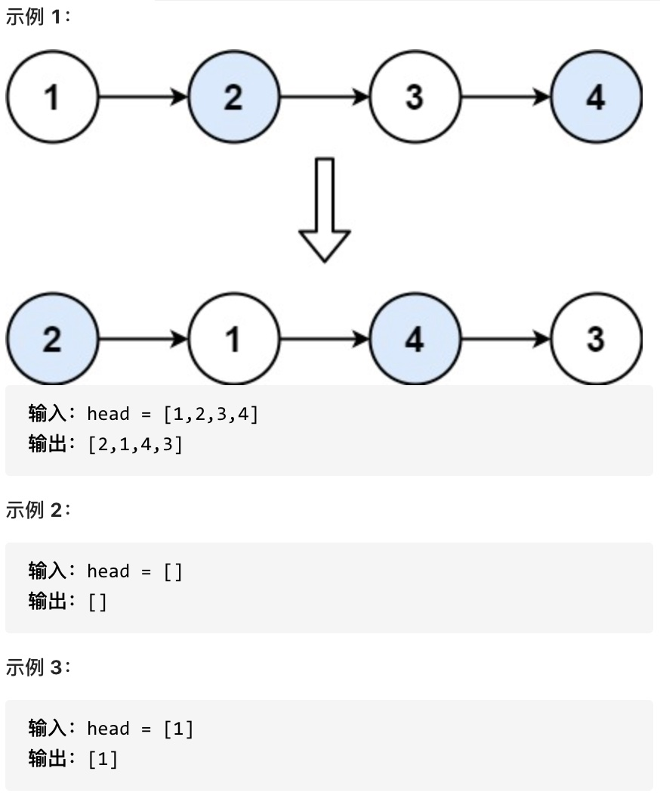
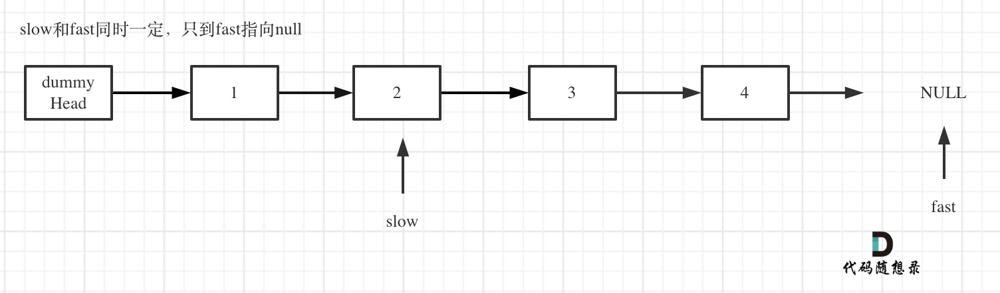
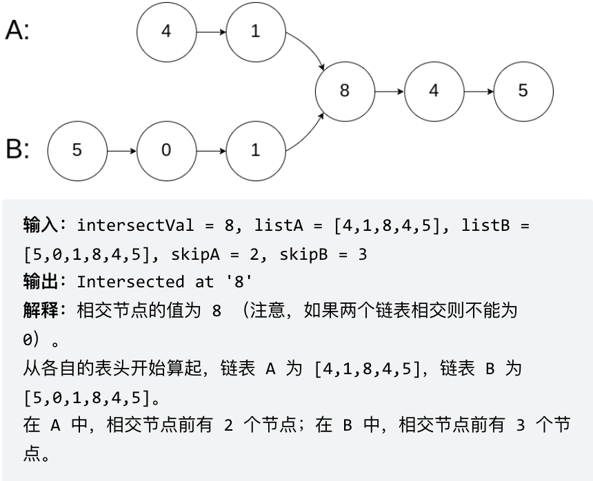
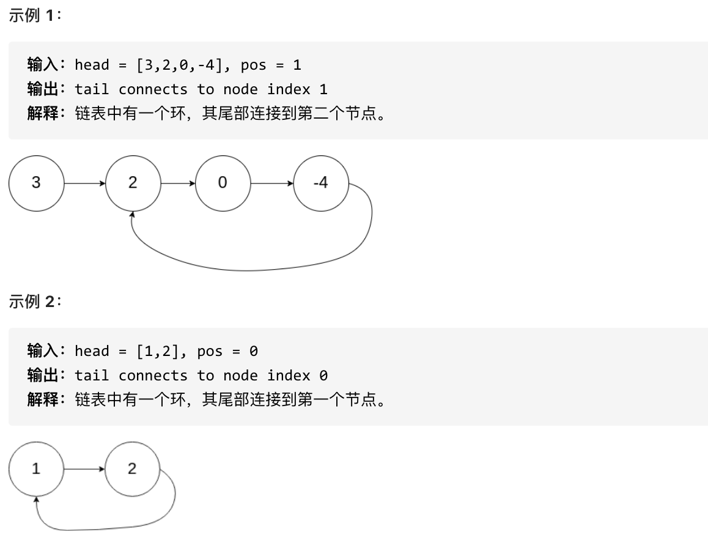

## 虚拟头节点

### 方法描述

**设置一个虚拟头结点**，这样原链表的所有节点就都可以按照统一的方式进行操作了。

### 经典例题

#### leetcode 203. 移除链表元素

[力扣题目链接(opens new window)](https://leetcode.cn/problems/remove-linked-list-elements/)

题意：删除链表中等于给定值 val 的所有节点。

示例 1： 输入：head = [1,2,6,3,4,5,6], val = 6 输出：[1,2,3,4,5]

示例 2： 输入：head = [], val = 1 输出：[]

示例 3： 输入：head = [7,7,7,7], val = 7 输出：[]

**参考代码**

```java
/**
 * 时间复杂度 O(n)
 * 空间复杂度 O(1)
 * @param head
 * @param val
 * @return
 */
public ListNode removeElements(ListNode head, int val) {
    // 设置一个虚拟的头结点
    ListNode dummy = new ListNode();
    dummy.next = head;

    ListNode cur = dummy;
    while (cur.next != null) {
        if (cur.next.val == val) {
            cur.next = cur.next.next;
        } else {
            cur = cur.next;        
        }
    }
    return dummy.next;
}
```

#### leetcode 24. 两两交换的节点

**题目描述**

[力扣题目链接(opens new window)](https://leetcode.cn/problems/swap-nodes-in-pairs/)

给定一个链表，两两交换其中相邻的节点，并返回交换后的链表。

你不能只是单纯的改变节点内部的值，而是需要实际的进行节点交换。



**思路解析**


**参考代码**

```java
class Solution {
  public ListNode swapPairs(ListNode head) {
       ListNode dummy = new ListNode(-1); // 设置一个虚拟头结点
       dummy.next = head; // 将虚拟头结点指向head，这样方便后面做删除操作
       ListNode curr=dummy;
       ListNode temp; //保存两个节点后的节点
       ListNode firstNode; //保存curr后的第一个节点
       ListNode secondNode; //保存curr后的第二个节点
       while(curr.next!=null&&curr.next.next!=null)
       {
           firstNode=curr.next;
           secondNode=firstNode.next;
           temp=secondNode.next;
           curr.next=secondNode; // 步骤一
           secondNode.next=firstNode; //步骤二
           firstNode.next=temp; // 步骤三
           curr=firstNode; //重新设置为原先在secondNode位置上的节点
       }
      return dummy.next;
       
    }
}
```


#### leetcode 19. 删除链表的倒数第N个节点

**题目描述**

[力扣题目链接(opens new window)](https://leetcode.cn/problems/remove-nth-node-from-end-of-list/)

给你一个链表，删除链表的倒数第 n 个结点，并且返回链表的头结点。

进阶：你能尝试使用一趟扫描实现吗？

示例 1：


输入：head = [1,2,3,4,5], n = 2 输出：[1,2,3,5]

示例 2：

输入：head = [1], n = 1 输出：[]

示例 3：

输入：head = [1,2], n = 1 输出：[1]

**思路解析**

使用快慢指针和虚拟头节点，让快节点从虚拟头节点开始，提前移动**n+1**步。

然后再让快节点和慢节点同时移动直到快节点移动到最后一个节点的后一个位置（**null**)



此时快节点和慢节点之间间隔n个节点，慢节点位于要删除的节点的前一个节点位置

直接删除即可

```java
class Solution {
    public ListNode removeNthFromEnd(ListNode head, int n) {
        //新建一个虚拟头节点指向head
        ListNode dummyNode = new ListNode(0);
        dummyNode.next = head;
        //快慢指针指向虚拟头节点
        ListNode fastIndex = dummyNode;
        ListNode slowIndex = dummyNode;

        // 快指针移动n+1步，使得快慢指针相差 n 个结点即可
        for (int i = 0; i <= n; i++) {
            fastIndex = fastIndex.next;
        }
        // 两个指针同时移动，直到快指针移动到最后一个节点的后一个位置（null)
        while (fastIndex != null) {
            fastIndex = fastIndex.next;
            slowIndex = slowIndex.next;
        }

        // 检查 slowIndex.next 是否为 null，以避免空指针异常
        if (slowIndex.next != null) {
            slowIndex.next = slowIndex.next.next; // 直接删除节点
        }
        return dummyNode.next;
    }
}
```

#### leetcode 2 两数相加

**题目描述**

给你两个 **非空** 的链表，表示两个非负的整数。它们每位数字都是按照 **逆序** 的方式存储的，并且每个节点只能存储 **一位** 数字。

请你将两个数相加，并以相同形式返回一个表示和的链表。

你可以假设除了数字 0 之外，这两个数都不会以 0 开头。

 

**示例 1：**


```
输入：l1 = [2,4,3], l2 = [5,6,4]
输出：[7,0,8]
解释：342 + 465 = 807.
```

**示例 2：**

```
输入：l1 = [0], l2 = [0]
输出：[0]
```

**示例 3：**

```
输入：l1 = [9,9,9,9,9,9,9], l2 = [9,9,9,9]
输出：[8,9,9,9,0,0,0,1]
```

 

**提示：**

- 每个链表中的节点数在范围 `[1, 100]` 内
- `0 <= Node.val <= 9`
- 题目数据保证列表表示的数字不含前导零

**思路解析**

本题应当模拟加法的竖式操作。首先建立虚拟头节点pre，然后从 **`l1`** 和 **`l2`** 的第一个节点开始进行加法运算。第一个节点的加法运算的进位可以视为0，然后将 **`l1`** 和 **`l2`** 的节点和与10相除的结果作为进位，**`l1`** 和 **`l2`** 的节点和与10的余数作为新节点的值。注意**`l1`** 和**`l2`** 的长度不一致，因此需要判断是否节点为空，为空的节点视为0即可。

**参考代码**

```java
class Solution {
    public ListNode addTwoNumbers(ListNode l1, ListNode l2) {
        ListNode dummy=new ListNode(0);
        ListNode curr=pre;
        int carry=0;
        while(l1!=null||l2!=null)
        {
            // 判断节点是否为空，空节点视为0
            int x=l1==null?0:l1.val;
            int y=l2==null?0:l2.val;
            int sum=x+y+carry;
            // 计算进位
            carry=sum/10;
            // 计算新节点的值
            curr.next=new ListNode(sum%10);
            curr=curr.next;
            // 防止越界，只有节点不为空的时候再向下遍历
            if(l1!=null)l1=l1.next;
            if(l2!=null)l2=l2.next;
        }
        // 注意最后一位的进位可能导致结果多出一位比如：99+10=109
        if(carry==1)
        {
            curr.next=new ListNode(1);
        }
        return dummy.next;
    }
}
```


## 反转操作

### 思路解析

只需要改变链表的next指针的指向，直接将链表反转 ，而不用重新定义一个新的链表

定义节点

- curr：当前节点
- prev：当前节点的上一个节点
- temp：当前节点的下一个节点

操作

- 记录curr的下一个指针temp
- 将指针反转，让curr指向prev
- 将prev节点设置为curr
- 将curr设置为temp


### 经典例题

#### leetcode 206. 翻转链表

[力扣题目链接(opens new window)](https://leetcode.cn/problems/reverse-linked-list/)

题意：反转一个单链表。

示例: 输入: 1->2->3->4->5->NULL 输出: 5->4->3->2->1->NULL

**参考代码**

```java
class Solution {
    public ListNode reverseList(ListNode head) {
       	ListNode prev=null;
        ListNode curr=head;
        ListNode temp=null;
        while(curr!=null)
        {
            temp=curr.next;
            curr.next=prev;
            prev=curr;
            curr=temp;
        }
        
    }
}
```

#### **BM2** **链表内指定区间反转**

**题目描述**

将一个节点数为 size 链表 m 位置到 n 位置之间的区间反转，要求时间复杂度 O(n)，空间复杂度 O(1)。
例如：
给出的链表为 1→2→3→4→5→NULL m=2,n=4
返回 1→4→3→2→5→NULL

数据范围： 链表长度 0<size≤10000<size≤1000，链表中每个节点的值满足 ∣val∣≤1000

要求：时间复杂度 O(n) ，空间复杂度 O(n)

进阶：时间复杂度 O(n)，空间复杂度 O(1)

示例1

输入：

```
{1,2,3,4,5},2,4
```

返回值：

```
{1,4,3,2,5}
```

示例2

输入：

```
{5},1,1
```

返回值：

```
{5}
```

**思路解析**

- 固定子区间外的节点。
- 在需要反转的区间里，每遍历到一个节点，让这个新节点来到反转部分的起始位置。
- 变量解释
  - pre：待反转的区间之前的一个节点
  - curr：待反转区间的第一个节点
  - temp：curr的后驱节点，将temp节点反转到起始位置

**参考代码**

```java
public ListNode reverseBetween (ListNode head, int m, int n) {
        // write code here
    	// 虚拟头节点
        ListNode dummy=new ListNode(0);
        dummy.next=head;
        ListNode pre=dummy;
        ListNode curr=head;
    	// 求出pre和curr
        for(int i=1;i<m;i++)
        {
            pre=curr;
            curr=curr.next;
        }
        for(int i=m;i<n;i++)
        {
            ListNode temp=curr.next;
            // 跳过一个节点
            curr.next=temp.next;
            // temp指向待反转区间的第一个节点
            temp.next=pre.next;
            pre.next=temp;
        }
        return dummy.next;
    }
```


## 判断链表是否相交

### 思路解析

- 求出A链表和B链表的长度
- 让currB到currA对齐的位置
- 此时比较curA和curB是否相同，如果不相同，同时向后移动curA和curB，如果遇到curA == curB，则找到交点。

### 经典例题

#### leetcode 160. 链表相交

[力扣题目链接(opens new window)](https://leetcode.cn/problems/intersection-of-two-linked-lists-lcci/)

给你两个单链表的头节点 headA 和 headB ，请你找出并返回两个单链表相交的起始节点。如果两个链表没有交点，返回 null 。

图示两个链表在节点 c1 开始相交：


题目数据 保证 整个链式结构中不存在环。

注意，函数返回结果后，链表必须 保持其原始结构 。

示例 1：



示例 2：


示例 3：


## 

**参考代码**

```java
public class Solution {
    public ListNode getIntersectionNode(ListNode headA, ListNode headB) {
        ListNode currA = headA;
        ListNode currB = headB;
        int lenA = 0, lenB = 0;
        while (currA != null) { // 求链表A的长度
            lenA++;
            currA = currA.next;
        }
        while (currB != null) { // 求链表B的长度
            lenB++;
            currB = currB.next;
        }
        // 将当前指针回到头节点
        currA = headA;
        currB = headB;
        // 让currA为最长链表的头，lenA为其长度
        if (lenB > lenA) {
            //1. swap (lenA, lenB); 交换长度
            int tmpLen = lenA;
            lenA = lenB;
            lenB = tmpLen;
            //2. swap (currA, currB); 交换节点
            ListNode tmpNode = currA;
            currA = currB;
            currB = tmpNode;
        }
        // 求长度差
        int gap = lenA - lenB;
        // 让currA和currB在同一起点上（末尾位置对齐）
        for(int i=0;i<gap;i++)
        {
            currA=currA.next;
        }
        // 遍历currA 和 currB，遇到相同则直接返回
        while (currA != null) {
            if (currA == currB) {
                return currA;
            }
            currA = currA.next;
            currB = currB.next;
        }
        return null;
    }

}
```

## 环形链表

### 思路解析

#### 判断是否是环形链表

使用快慢指针法，设置一个快指针和慢指针，让快指针一次移动两步，慢指针一次移动一步，若两个指针能相遇则该链表是环形链表

**证明过程**

fast指针一定先进入环中，如果fast指针和slow指针相遇的话，一定是在环中相遇

其实相对于slow来说，fast是一个节点一个节点的靠近slow的

#### **如何找到环的入口**

从头结点出发一个指针，从相遇节点 也出发一个指针，这两个指针每次只走一个节点， 那么当这两个指针相遇的时候就是 环形入口的节点。

### 经典例题

#### leetcode 142. 环形链表II

**题目描述**

[力扣题目链接(opens new window)](https://leetcode.cn/problems/linked-list-cycle-ii/)

题意： 给定一个链表，返回链表开始入环的第一个节点。 如果链表无环，则返回 null。

为了表示给定链表中的环，使用整数 pos 来表示链表尾连接到链表中的位置（索引从 0 开始）。 如果 pos 是 -1，则在该链表中没有环。

**说明**：不允许修改给定的链表。



## 

**参考代码**

```java
public class Solution {
    public ListNode detectCycle(ListNode head) {
        ListNode slow = head;
        ListNode fast = head;
        while (fast != null && fast.next != null) {
            slow = slow.next;
            fast = fast.next.next;
            if (slow == fast) {// 有环
                ListNode index1 = fast;
                ListNode index2 = head;
                // 两个指针，从头结点和相遇结点，各走一步，直到相遇，相遇点即为环入口
                while (index1 != index2) {
                    index1 = index1.next;
                    index2 = index2.next;
                }
                return index1;
            }
        }
        return null;
    }
}
```

