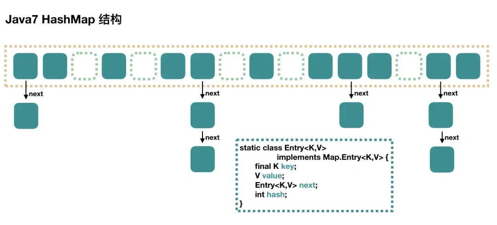
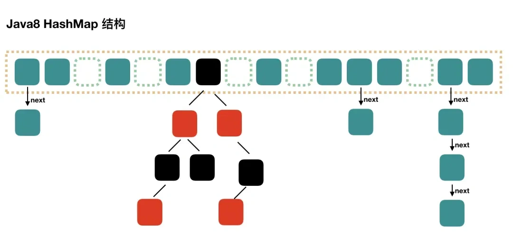

## HashMap

### HashMap是有序的吗

**`HashMap` 本身是** **无序的**。

- `HashMap` 的数据存储是基于 **哈希表**，元素在 **桶（bucket）** 中的位置 **由哈希值计算决定**。
- 因此，**`put()` 的顺序和 `entrySet()`、`keySet()` 遍历的顺序 不一定相同，每次遍历的顺序**。

#### 如何按照 `put()` 顺序遍历？

如果希望 `HashMap` **按照 `put()` 的顺序遍历**，可以使用 **`LinkedHashMap`**。

#### LinkedHashMap是如何实现保持插入顺序的

- `LinkedHashMap` 继承自 `HashMap`，但**额外维护了一个** **双向链表（Linked List）** 来记录插入顺序。
- 当元素被 `put()` 进 `LinkedHashMap` 时，它既被存入哈希表，又被添加到链表的尾部。

### HashMap底层是如何实现的？

#### JDK1.7之前

HashMap 数据结构是数组和链表，HashMap通过哈希算法将元素的键（Key）映射到数组中的槽位（Bucket）。如果多个键映射到同一个槽位，以链表的形式存储在同一个槽位上，因为链表的查询时间是$O(n)$，所以冲突很严重，一个索引上的链表非常长，效率就比较低。

#### JDK1.8及以后

当一个链表的长度超过 **8** 同时数组长度超过 **64** 的时候就转换数据结构，不再使用链表存储，而是使用 **红黑树** ，查找时使用红黑树，时间复杂度$O(log n)$，可以提高查询性能，但是在数量较少时，即数量小于 **6** 时，会将红黑树转换回链表。

### 为什么要转换成红黑树？

- 解决 **哈希冲突导致链表过长** 的问题，避免查询退化成 $O(n)$。红黑树的查询、插入、删除均为 $O(log n)$，优化 `HashMap` 性能。

### 为什么是超过8转换成红黑树？

- **哈希冲突导致链表过长的概率极低** ：`HashMap` 使用 **哈希函数 + 数组 + 链表（或红黑树）** 来存储数据。 如果哈希函数分布良好，**不同键的哈希值均匀分布到不同桶中** ，那么链表过长的概率极低。
- **链表长度 ≤ 8 时，链表查询性能可以接受** ：链表遍历 **8 次以内**，对于 CPU 来说 **影响不大**，所以 **不必过早转换成红黑树**，可以避免不必要的性能开销。
  - 链表的最坏情况查询次数：**8 次**。
  - 红黑树的最坏情况查询次数：**log₂(8) = 3 次**。
- 红黑树需要 **额外的内存** 来存储：相比于链表（只有 `next` 指针），红黑树的节点结构更复杂，占用的空间 **更大**。

、

### 哈希冲突如何解决，链表转红黑树的条件是什么？

#### 哈希冲突的解决方式

HashMap 哈希冲突是通过拉链法（闭散列法）来解决的，当有新的键值对要插入到 **`HashMap`** 中时，会先计算键的哈希值，然后根据哈希值确定在数组中的位置。如果该位置已经有元素了，就会将新的元素插入到该位置的链表尾部（在 Java 8 及之后的版本中，当链表长度达到一定阈值时会转换为红黑树）。这样，同一个位置上的多个元素就通过链表（或红黑树）的方式连接起来，从而解决了哈希冲突。

#### 链表转红黑树的条件

当链表的长度大于等于 **8** 时，并且 **`HashMap`** 的容量大于等于 **64** ，会将链表转换为红黑树。这是因为当链表长度较长时，查找、插入和删除操作的时间复杂度会退化为$O(n)$，而红黑树可以将这些操作的时间复杂度保持在$O(logn)$，从而提高了性能。

### HashMap进行插入、删除等操作的时间复杂度是什么？

#### 不存在哈希冲突时

- 插入一个键值对只需要根据哈希值直接定位到对应的数组位置，然后将元素插入即可，时间复杂度为$O(1)$。
- 类似插入操作，在没有哈希冲突的情况下，通过哈希值可以直接找到要删除的元素所在位置，然后进行删除，时间复杂度也是$O(1)$。

#### 存在哈希冲突时，采用链地址法解决冲突且底层结构为链表时

- 当发生哈希冲突，新元素需要插入到链表中时
  - JDK1.7以前：插入操作是在链表头部进行，时间复杂度为$O(1)$。
  - JDK1.8及以后：插入操作在链表尾部进行，需要遍历链表找到尾部节点，时间复杂度为$O(n)$。n 为链表的长度。
- 需要遍历链表找到要删除的节点，然后进行删除操作，平均时间复杂度为$O(n)$。

#### 存在哈希冲突时，采用链地址法解决冲突且为红黑树结构

- 红黑树的插入操作需要进行一系列的平衡调整操作，以保持红黑树的性质，时间复杂度为$O(logn)$，n 为红黑树的节点数。
- 删除操作也可能会引发红黑树的平衡调整，时间复杂度同样为$O(logn)$。