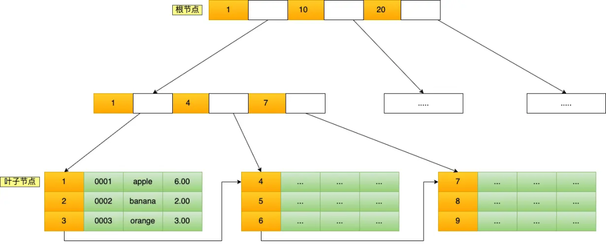
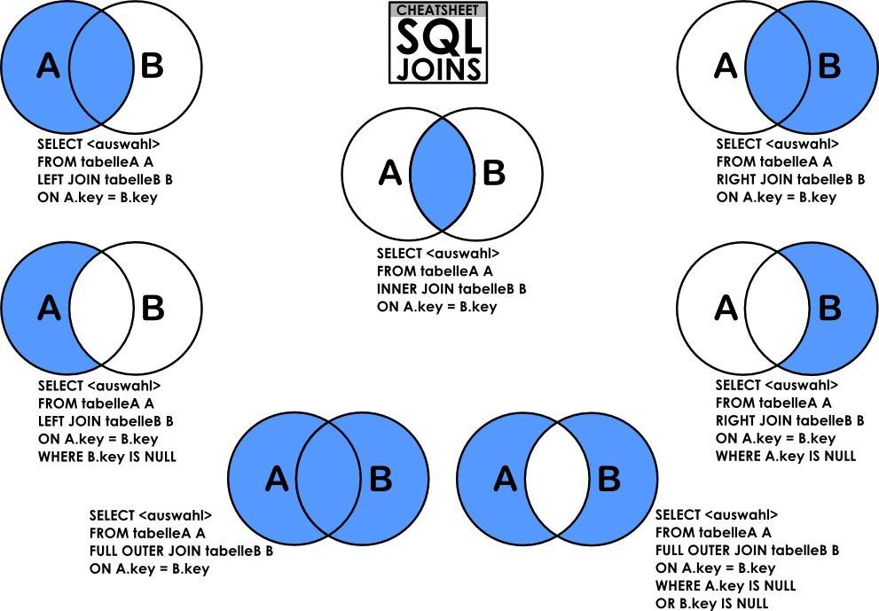

## 存储引擎

### MySQL的存储引擎有哪些？InnoDB、MyISAM和Memory有什么特点？

- **`InnoDB`** ：InnoDB是MySQL的默认存储引擎，具有ACID事务支持、行级锁、外键约束等特性。它适用于高并发的读写操作，支持较好的数据完整性和并发控制。
- **`MyISAM`** ：MyISAM是MySQL的另一种常见的存储引擎，具有较低的存储空间和内存消耗，适用于大量读操作的场景。然而，MyISAM不支持事务、行级锁和外键约束，因此在并发写入和数据完整性方面有一定的限制。
- **`Memory`** ：Memory引擎将数据存储在内存中，适用于对性能要求较高的读操作，但是在服务器重启或崩溃时数据会丢失。它不支持事务、行级锁和外键约束。

## 索引

### 数据库索引的原理是什么，为什么它能加快查询速度？

#### 索引的底层原理

MySQL的InnoDB 引擎是用了B+树作为了索引的数据结构。

B+Tree 是一种多叉树，叶子节点才存放数据，非叶子节点只存放索引，而且每个节点里的数据是 **按主键顺序存放** 的。每一层父节点的索引值都会出现在下层子节点的索引值中，因此在叶子节点中，包括了所有的索引值信息，并且每一个叶子节点都有两个指针，分别指向下一个叶子节点和上一个叶子节点，形成一个双向链表。

#### 加快查询速度的原因

B+Tree 存储千万级的数据只需要 3-4 层高度，这意味着从千万级的表查询目标数据最多需要 3-4 次磁盘 I/O，所以 **B+Tree 相比于 B 树和二叉树来说，最大的优势在于查询效率很高，因为即使在数据量很大的情况，查询一个数据的磁盘 I/O 依然维持在 3-4次。**

### 什么是聚簇索引

聚簇索引是指表数据是和索引一起存储的。InnoDB 中的主键索引就属于聚簇索引。聚簇索引的叶结点存储整条记录（包含了主键值），二级索引的叶结点存储行的主键值。

它使用的是B+树作为索引的存储结构，非叶子节点都是索引关键字，但非叶子节点中的关键字中不存储对应记录的具体内容或内容地址。叶子节点上的数据是整条记录。

### 数据库索引为什么不使用其他数据结构作为底层数据结构

#### 不使用Hash表

- **B+树内存消耗小** ：利用Hash需要把数据全部加载到内存中，如果数据量大，是一件很消耗内存的事，而采用B+树，是基于按照节点分段加载，由此减少内存消耗。
- **Hash表不适用于范围查找** ：对于等值查找，Hash效率更快（$O(1)$的时间复杂度），数据库中经常查询多条数据，这时候由于B+数据的有序性，与叶子节点又有链表相连，他的查询效率会比Hash快的多。

#### 不使用B树

- **B+树的高度更小** ：B+树的 **非叶子节点不保存数据** ，**只保存索引**，所以同样大小的节点，b+树相对于b树能够有更多的分支，使得这棵树更加矮胖，查询时做的IO操作次数也更少。
- **B+树的范围查找效率高** ：B+Tree 叶子节点采用的是双链表连接，适合 MySQL 中常见的基于范围的顺序查找，而 B 树无法做到这一点。

#### 不使用二叉树

- **B+树高度更小，磁盘访问次数少** ：：对于有 N 个叶子节点的 B+Tree，其搜索复杂度为$O(log_dN)$，其中 d 表示节点允许的最大子节点个数为 d 个。在实际的应用当中，即使数据达到千万级别时，B+Tree 的高度依然维持在 3~4 层左右，也就是说一次数据查询操作只需要做 3~4 次的磁盘 I/O 操作就能查询到目标数据。而二叉树的每个父节点的儿子节点个数只能是 2 个，意味着其搜索复杂度为 $O(logN)$，这已经比 B+Tree 高出不少，因此二叉树检索到目标数据所经历的磁盘 I/O 次数要更多。

## SQL基础

### 左连接、右连接和内连接的区别是什么？

- **左连接** ：以左表为基础，返回左表中的所有行，以及右表中与左表匹配的行。如果右表中没有与左表匹配的行，则右表中的列值显示为 NULL。
- **右连接** ：与左连接相反，以右表为基础，返回右表中的所有行，以及左表中与右表匹配的行。如果左表中没有与右表匹配的行，则左表中的列值显示为 NULL。
- **内连接**：只返回两个表中连接条件匹配的行，即只返回同时存在于左表和右表中的数据，不包含任何一方表中无法匹配的行。

#### **左连接时若右边表不存在匹配记录会怎样？**

会显示 null 列。

因为左连接是以左边表为基础，确保返回左边表中的所有行，对于左边表中没有在右边表找到匹配的行，无法从右边表获取对应的数据，所以用`NULL`来表示缺失的值。

## 事务

### 事务的并发问题有哪些？

- **脏读** ：一个事务读取数据并且对数据进行了修改，这个修改对其他事务来说是可见的，即使当前事务没有提交。这时另外一个事务读取了这个还未提交的数据，但第一个事务突然回滚，导致数据并没有被提交到数据库，那第二个事务读取到的就是脏数据
- **不可重复读** ：在同一事务中，读取同一数据两次，但由于其他事务的提交，读取的结果不同。
- **幻读** ：在一个事务内多次查询某个符合查询条件的「记录数量」，如果出现前后两次查询到的记录数量不一样的情况，就意味着发生了幻读现象。

### 事务的隔离级别有哪些，会发生什么现象。是如何实现的

#### 隔离级别

- **读未提交（read uncommitted）** ：一个事务还没提交时，它做的变更就能被其他事务看到；
- **读提交（read committed）** ：一个事务提交之后，它做的变更才能被其他事务看到；
- **可重复读（repeatable read）** ：一个事务执行过程中看到的数据，一直跟这个事务启动时看到的数据是一致的，**MySQL InnoDB 引擎的默认隔离级别**；
- **串行化（serializable）** ：对记录加上读写锁，在多个事务对这条记录进行读写操作时，如果发生了读写冲突的时候，后访问的事务必须等前一个事务执行完成，才能继续执行；

#### 发生的现象

- 在读未提交隔离级别下，可能发生脏读、不可重复读和幻读现象；
- 在读提交隔离级别下，可能发生不可重复读和幻读现象，但是不可能发生脏读现象；
- 在可重复读隔离级别下，可能发生幻读现象，但是不可能出现脏读和不可重复读现象；
- 在串行化隔离级别下，脏读、不可重复读和幻读现象都不可能会发生。

#### 底层实现

- 读未提交：因为可以读到未提交事务修改的数据，所以直接读取最新的数据即可
- 读提交：创建ReadView实现，在每个语句执行前都会重新生成一个 Read View
- 可重复读：创建ReadView实现，启动事务时生成一个 Read View，然后整个事务期间都在用这个 Read View。
- 串行化：加入读写锁

### MVCC是什么，是如何实现的

MVCC（Multi-Version Concurrency Control，多版本并发控制）是一种并发控制机制，允许多个事务同时读取和写入数据库，而无需互相等待，从而提高数据库的并发性能。

在 MVCC 中，数据库为每个事务创建一个数据快照。每当数据被修改时，MySQL 不会立即覆盖原有数据，而是生成新版本的记录。每个记录都保留了对应的版本号或时间戳。

## 日志

### 日志种类有哪些

- **redo log** ： Innodb 存储引擎层生成的日志，实现了事务中的 **持久性** ，主要 **用于掉电等故障恢复**
- **undo log** ： Innodb 存储引擎层生成的日志，实现了事务中的 **原子性** ，主要 **用于事务回滚和 MVCC**
- **bin log** ：Server层生成的日志，用于记录 MySQL 服务器上的所有更新和修改操作。

## SQL优化

### 慢查询SQL如何优化

- **分析查询语句** ：使用EXPLAIN命令分析SQL执行计划，找出慢查询的原因，比如是否使用了全表扫描，是否存在索引未被利用的情况等，并根据相应情况对索引进行适当修改。

- **创建或优化索引** 

  - 根据查询条件创建合适的索引，特别是经常用于WHERE子句的字段、Orderby 排序的字段、Join 连表查询的字典、 group by的字段，
  - 查询中经常涉及多个字段，考虑创建联合索引，使用联合索引要符合最左匹配原则，不然会索引失效

- **查询优化**  

  - 避免使用SELECT *，只查询真正需要的列
  - 使用覆盖索引，即索引包含所有查询的字段
  - 联表查询最好要以小表驱动大表，并且被驱动表的字段要有索引

  
